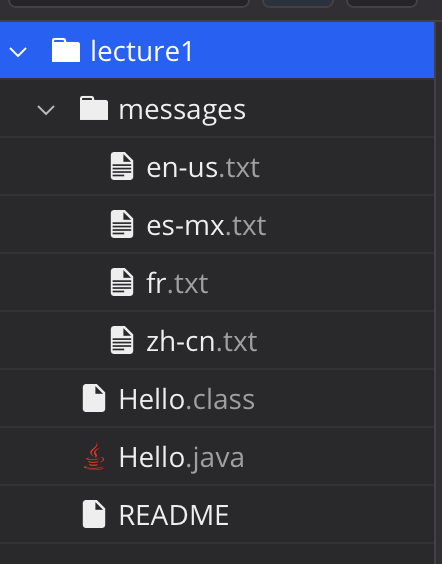

# Lab Report 1 - Remote Access and FileSystem
(Folders & Files Used)

 

# cd 
**Use of cd command with *no* arguments**


**Terminal:**
```
[user@sahara ~/lecture1]$ pwd
/home/lecture1
[user@sahara ~/lecture1]$ cd
[user@sahara ~]$
[user@sahara ~/lecture1]$ pwd
/home
```
**Explanation:**

When using the cd command without arguments, the output returns an empty line. However, the current directory in the command prompt is reset and the working directory is changed into the root folder. This is not an error.

**Use of cd command with a path to a directory as an argument**


**Terminal:**
```
[user@sahara ~]$ pwd
/home
[user@sahara ~]$ cd /home/lecture1
[user@sahara ~/lecture1]$ 
[user@sahara ~/lecture1]$ pwd
/home/lecture1
```
**Explanation:**

When using the cd command with a path to a directory as an argument, the output returns an empty line. However, the current working directory is changed to the given path. This is not an error.

**Use of cd command with a path to a file as an argument**


**Terminal:**
```
[user@sahara ~]$ pwd
/home
[user@sahara ~]$ cd /home/lecture1/Hello.java
bash: cd: /home/lecture1/Hello.java: Not a directory
```
**Explanation:**

When using the cd command with a path to a file, it outputs, "bash: cd: /home/lecture1/Hello.java: Not a directory". This is an error because the cd command only works with a path to a folder or directory. You cannot change the directory to a file.

# ls
**Use of ls command with *no* arguments**


**Terminal:**
```
[user@sahara ~]$ pwd
/home
[user@sahara ~]$ ls
lecture1
```
**Explanation:**

When using the ls command with no arguements, it prints out a list of the files/folders in the current directory. In the example, the current working directory is /home which contains the folder lecture1. This is not an error.

**Use of ls command with a path to a directory as an argument**


**Terminal:**
```
[user@sahara ~]$ pwd
/home
[user@sahara ~]$ ls lecture1
Hello.class  Hello.java  messages  README
```
**Explanation:**

When using the ls command with a directory as the argument, it lists out the files/folders in that directory. This is not an error.

**Use of ls command with a path to a file as an argument**


**Terminal:**
```
[user@sahara ~]$ pwd
/home
[user@sahara ~]$ ls /home/lecture1/Hello.java
/home/lecture1/Hello.java
```
**Explanation:**

When using the ls command with a path to a file as an argument, it outputs the file path. This is not an error.

# cat
**Use of cat command with *no* arguments**


**Terminal:**
```
[user@sahara ~]$ pwd
/home
[user@sahara ~]$ cat
cat
cat
```
**Explanation:**

When using the cat command with no arguments, the terminal continues to wait for input. It will repeat what you enter into terminal until the code stops. Since the command was given no path to read, it echoes what is enterred into the terminal.

**Use of cat command with a path to a directory as an argument**


**Terminal:**
```
[user@sahara ~]$ pwd
/home
[user@sahara ~]$ cat /home/lecture1
cat: /home/lecture1: Is a directory
```
**Explanation:**

When using the cat command with a path to a directory as an argument, it printed out '''cat: /home/lecture1: Is a directory'''. The terminal will print that the path leads to a directory. This is an error because the cat command did not do what it was supposed to.

**Use of cat command with a path to a file as an argument**


**Terminal:**
```
[user@sahara ~]$ pwd
/home
[user@sahara ~]$ cat /home/lecture1/Hello.java
import java.io.IOException;
import java.nio.charset.StandardCharsets;
import java.nio.file.Files;
import java.nio.file.Path;

public class Hello {
  public static void main(String[] args) throws IOException {
    String content = Files.readString(Path.of(args[0]), StandardCharsets.UTF_8);    
    System.out.println(content);
  }
}
```
**Explanation:**

When using the cat command with a path to a file as an argument, it printed out the contents of the file. This is not an error.
